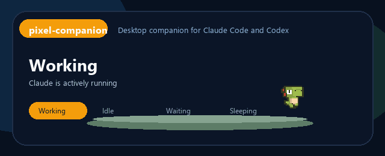
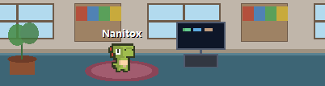
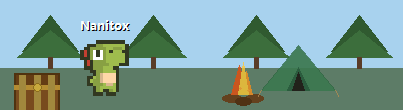
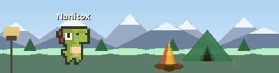
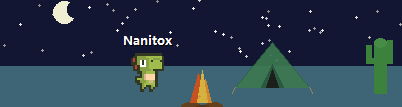
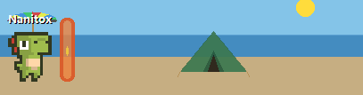
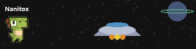
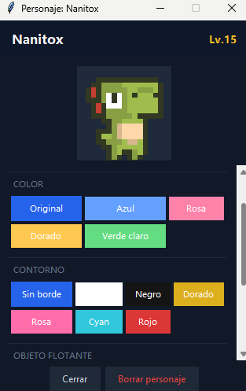
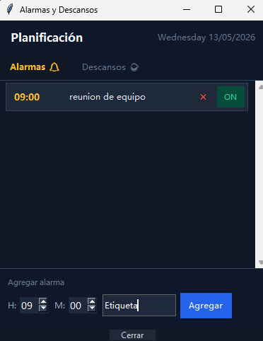
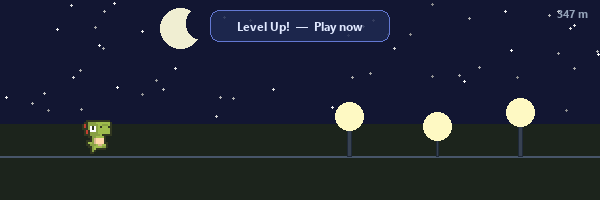

<div align="center">



# pixel-companion

**A pixel mascot that lives on your Windows desktop and reacts to your coding sessions.**

Works with **Claude Code** and **Codex** &nbsp;·&nbsp; **Windows only**

[](https://python.org)
[](https://github.com/Emi-Dz/pixel-companion)
[](LICENSE)

</div>

---

Pixel Companion sits quietly on your screen while you work. When you send a prompt to Claude or Codex, Dino gets to work. When the agent is waiting for your approval, Dino waits too. When you step away, Dino falls asleep.

It's not a productivity tool. It's a companion.

---

## States

Dino switches states automatically based on what your session is doing.

| State | When |
|---|---|
| **Working** | Claude or Codex is actively running |
| **Idle** | No active session |
| **Waiting** | The agent is waiting for your approval |
| **Sleeping** | You've been away for a while |

---

## Scenes

Six background scenes unlock as Dino levels up.

<table>
  <tr>
    <td align="center"><br/><sub>Office</sub></td>
    <td align="center"><br/><sub>Forest</sub></td>
    <td align="center"><br/><sub>Mountains</sub></td>
  </tr>
  <tr>
    <td align="center"><br/><sub>Night</sub></td>
    <td align="center"><br/><sub>Beach</sub></td>
    <td align="center"><br/><sub>Space</sub></td>
  </tr>
</table>

---

## Customization

<table>
  <tr>
    <td align="center"><br/><sub>Character editor — tint, outline, accessories, decorations</sub></td>
    <td align="center"><br/><sub>Alarms and break reminders</sub></td>
  </tr>
</table>

- **Character** — tint color, outline, floating accessories (crown, star, halo, lightning, heart, note, zzz), draggable decorations
- **Scene** — 10 grass color themes, 6 unlockable backgrounds
- **Alarms** — named alarms with snooze, scheduled to the minute
- **Breaks** — automatic reminders at a configurable interval and duration

---

## Features

**Companion**
- Reacts in real time to Claude Code and Codex activity
- Auto-installs the hooks on first launch — nothing to configure manually
- Auto-launches when a hook event arrives, even if the app was closed
- Compact window that stays out of your way

**Productivity**
- Break reminders with configurable interval and duration
- Named alarms with snooze
- XP system — Dino gains experience as you work and levels up over time

**Mini-game**



Unlocks when Dino levels up. Jump over obstacles, collect meters, beat your high score.

---

## Installation

### Requirements

- Windows 10 or 11
- Python 3.10 or later
- [Claude Code](https://claude.ai/code) and/or [Codex](https://github.com/openai/codex) installed

### Run

```powershell
git clone https://github.com/Emi-Dz/pixel-companion.git
cd pixel-companion/windows
pip install -r ../requirements.txt
python app.py
```

On first launch, Pixel Companion installs the event hooks for Claude Code and Codex automatically, then minimizes to the side of your screen.

> **Note:** You can add `windows/Iniciar Mascota.vbs` as a startup shortcut so Dino is always ready when you open your computer.

---

## How It Works

Pixel Companion listens on `127.0.0.1:8765` for local hook events. Both Claude Code and Codex call a small PowerShell script on every event, which forwards the payload to the app.

### Claude Code hook

Installed automatically into `~/.claude/hooks/`. Fires on:

`UserPromptSubmit` · `PreToolUse` · `PostToolUse` · `PermissionRequest` · `PreCompact` · `Stop` · `SubagentStop` · `SessionEnd`

### Codex hook

Installed automatically into `~/.codex/hooks.json`. Fires on:

`UserPromptSubmit` · `SessionStart` · `PreToolUse` · `PostToolUse` · `PermissionRequest` · `Stop`

If the app is not running when a hook fires, the script auto-launches it and retries the connection.

---

## XP System

Dino earns XP as you work:

| Event | XP |
|---|---|
| Tool completes (`PostToolUse` / `SubagentStop`) | +3 |
| Session stops (`Stop`) | +3 |
| Session ends (`SessionEnd`) | +2 |

Every 300 XP = 1 level. As Dino levels up, it literally grows — starting at half size (level 1) and reaching full size at level 20. Higher levels also unlock background scenes.

---

## Project Structure

```
pixel-companion/
├── windows/
│   ├── app.py                        Main application
│   ├── mascota-hook.ps1              Claude Code hook payload
│   ├── codex-hook.ps1                Codex hook payload
│   ├── Iniciar Mascota.vbs           Desktop shortcut helper
│   ├── assets/sprites/Dino/          Dino sprite sheets (4 states)
│   └── sounds/                       Sound effects
├── scripts/
│   └── generate_windows_media.py     Generates preview GIF from sprites
├── assets/                           Screenshots and preview GIF
├── requirements.txt
├── UPSTREAM.md
└── LICENSE
```

---

## Credits

- **[sk-ruban/notchi](https://github.com/sk-ruban/notchi)** — original macOS concept, interaction model, and companion design
- **[AptatoX/notchi-for-windows](https://github.com/AptatoX/notchi-for-windows)** — Windows port that directly inspired this project
- **[Arks](https://arks.itch.io/dino-characters)** — Dino character sprites

See [UPSTREAM.md](UPSTREAM.md) for full attribution notes.

---

## License

MIT. See [LICENSE](LICENSE).
